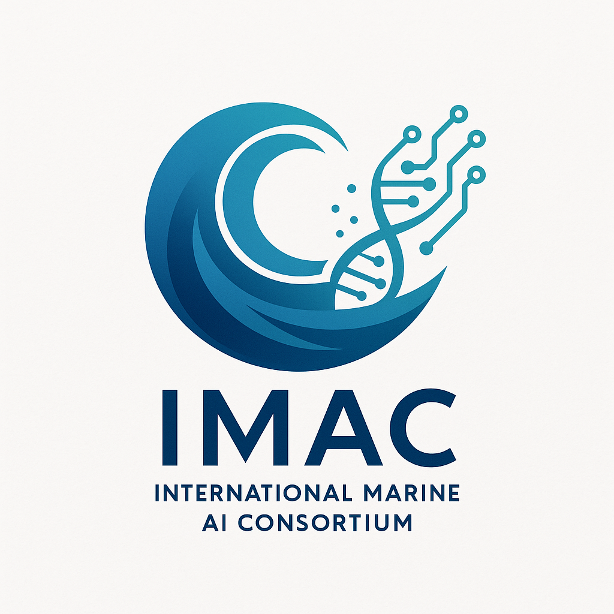

# Welcome to the International Marine AI Consortium (IMAC)



## 🌊 Accelerating Marine Data Generation for Biomonitoring and Regeneration Action

The International Marine AI Consortium (IMAC) is an open-source collaborative initiative bringing together technologists, scientists, educators, and conservationists from diverse backgrounds to develop AI-powered solutions for ocean science and conservation.

## 🎯 Our Mission

We aim to advance ocean science and conservation through:
- **Collaborative development** of open-source AI solutions
- **Widespread knowledge sharing** across disciplines and borders
- **Creation of new technological platforms** for marine monitoring
- **Fostering new leadership** in marine sciences

*Learn more in our [Charter](./core/charter.md)*

## 🤝 Why Join IMAC?

Whether you're a marine biologist, data scientist, hardware engineer, educator, or simply passionate about ocean conservation, IMAC provides:

- **Real-world impact**: Contribute to solutions that directly benefit ocean health
- **Interdisciplinary collaboration**: Work with experts from various fields
- **Open science**: All work is open-source and accessible
- **Learning opportunities**: Access educational resources and workshops
- **AI-ready infrastructure**: Designed for both human and AI agent contributions

## 🏗️ How We're Organized: The Pod System

IMAC uses a **pod-based structure** where each pod operates with local autonomy while coordinating with others for integrated solutions:

### 🧭 [Core Pod](./core/README.md)
The coordination hub providing governance, orchestration, and shared infrastructure.
- Maintains the consortium charter and principles
- Manages cross-pod communication protocols
- Provides agent orchestration templates

### 🔬 [Science Pod](./science/README.md)
Conducts marine research with reproducible, rigorous methodologies.
- **Marine Biology**: Species surveys, biodiversity analysis, ecosystem studies
- **Bioinformatics**: eDNA analysis, genomic data processing, taxonomic classification
- Example: Analyze coral reef biodiversity from survey data

### 🔧 [Hardware Pod](./hardware/README.md)
Manages physical devices and edge computing for field deployment.
- **Sensors**: Water quality monitors, underwater cameras, acoustic devices
- **Edge AI**: Deploy models on buoys, drones, and autonomous vehicles
- Example: Calibrate sensors and deploy real-time species detection on underwater drones

### 💻 [Software Pod](./software/README.md)
Develops AI models and computational tools.
- **AI Models**: Species classifiers, ecosystem predictors, anomaly detectors
- **MarineAI-Lab**: Simulation environments for testing algorithms
- Example: Train a neural network to identify marine species from underwater images

### 📚 [Education Pod](./education/README.md)
Creates learning materials and conducts outreach.
- **Tutorials**: Step-by-step guides on marine AI concepts
- **Workshops**: Hands-on sessions with real data
- **Curriculum**: Structured courses including eDNA analysis
- Example: Interactive notebook teaching students to analyze environmental DNA

## 🚀 Getting Started

### For New Contributors

1. **Read the [Charter](./core/charter.md)** to understand our mission and values
2. **Explore pod directories** to find your area of interest
3. **Check `*_context.md` files** in each pod for detailed guidelines
4. **Look at example notebooks** to see our work structure
5. **Join the discussion** (links coming soon)

### Quick Start Examples

#### 🐟 Want to analyze marine data?
```bash
cd science/marine-biology/
# Open Marine_Biodiversity_Survey_Analysis.ipynb
```

#### 🤖 Want to train an AI model?
```bash
cd software/AI/
# Open Marine_Species_Classifier_Training.ipynb
```

#### 📡 Want to work with sensors?
```bash
cd hardware/sensors/
# Open Sensor_Calibration_and_Test.ipynb
```

#### 📖 Want to teach or learn?
```bash
cd education/tutorials/
# Open Intro_to_Marine_AI.ipynb
```

## 📂 Repository Structure

```
IMAC-community/
├── 📋 README.md (this file)
├── 📜 core/
│   ├── 📄 charter.md              # Consortium governance
│   ├── 📄 core_context.md         # Pod operational guidelines
│   └── 📄 README.md               # Core pod overview
├── 🔬 science/
│   ├── 📄 science_context.md      # Research guidelines
│   ├── 📁 marine-biology/         # Biodiversity studies
│   └── 📁 bioinformatics/         # eDNA & genomics
├── 🔧 hardware/
│   ├── 📄 hardware_context.md     # Device guidelines
│   ├── 📁 sensors/                # Sensor deployments
│   └── 📁 EdgeAI/                 # Edge computing
├── 💻 software/
│   ├── 📄 software_context.md     # Development guidelines
│   ├── 📁 MarineAI-Lab/           # Simulations
│   └── 📁 AI/                     # Model development
└── 📚 education/
    ├── 📄 education_context.md    # Teaching guidelines
    ├── 📁 tutorials/              # Learning materials
    └── 📁 workshops/              # Interactive sessions
```

## 🤖 AI Agent Integration

IMAC is designed to facilitate contributions from AI agents:
- Structured `*_context.md` files provide operational guidelines
- Standardized notebook templates with metadata
- Clear inter-module communication protocols
- Agent orchestration capabilities in the Core pod

## 🌟 Contributing

We welcome contributions of all kinds! See our [contribution guidelines](./core/charter.md#participation-guidelines) to get started.

### Ways to Contribute
- 🔬 Add new analysis notebooks
- 🐛 Report bugs or suggest features
- 📝 Improve documentation
- 🎨 Create visualizations
- 🔧 Develop hardware integrations
- 📚 Design educational content
- 🌐 Translate materials
- 💬 Help others in discussions

## 🛡️ Our Principles

- **Open Collaboration**: Inclusive, transcending boundaries
- **Scientific Rigor**: Reproducible, transparent, peer-reviewed
- **Ethical AI**: Responsible, safe, with human oversight
- **FAIR Data**: Findable, Accessible, Interoperable, Reusable
- **Sustainability**: Long-term ocean ecosystem health

## 📞 Connect With Us

- **GitHub Discussions**: [Coming soon]
- **Mailing List**: [Coming soon]
- **Website**: [Under development]

## 📜 License

All IMAC-developed materials are open-source under [MIT/Apache 2.0] licenses.

---

**Together, we're building the future of marine AI for ocean conservation! 🌊🤖🐋**

*Join us in our mission to understand and protect our oceans through the power of collaborative AI development.*