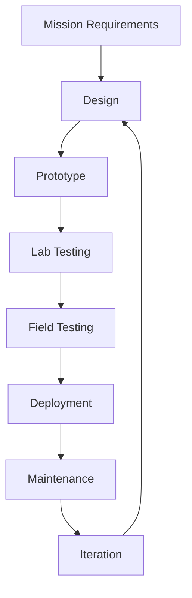

# Hardware Pod - Ocean Sensing & Edge AI

## Overview

The Hardware pod is where digital meets physical in our quest to understand the oceans. We develop, deploy, and maintain the sensors, drones, and edge computing devices that serve as IMAC's eyes and ears in marine environments worldwide.

## Purpose & Mission

The Hardware pod:
- **Develops** innovative marine sensing technologies
- **Deploys** autonomous monitoring systems globally
- **Collects** high-quality environmental data
- **Processes** data at the edge for real-time insights
- **Maintains** a reliable network of ocean observers

## Technology Domains

### Underwater Sensors
Measuring the ocean's vital signs:
- **Environmental Monitoring**: Temperature, pH, salinity, dissolved oxygen
- **Acoustic Systems**: Marine mammal detection, underwater soundscapes
- **Optical Sensors**: Turbidity, chlorophyll, bioluminescence
- **Chemical Analyzers**: Nutrient levels, pollutant detection

### Autonomous Vehicles
Extending our reach across the seas:
- **Underwater Drones (AUVs)**: Deep-sea exploration, reef surveys
- **Surface Vehicles (ASVs)**: Long-duration monitoring, sample collection
- **Aerial Drones**: Coastal mapping, wildlife surveys, oil spill detection
- **Hybrid Systems**: Multi-domain platforms for comprehensive monitoring

### Edge Computing
Intelligence at the point of collection:
- **Real-time Processing**: On-device AI for immediate insights
- **Data Compression**: Smart filtering to reduce transmission needs
- **Anomaly Detection**: Alert systems for unusual events
- **Power Management**: Optimizing for long-term deployment

### Communication Systems
Connecting the ocean to the cloud:
- **Satellite Links**: Global coverage for remote deployments
- **LoRaWAN Networks**: Low-power, long-range coastal monitoring
- **Acoustic Modems**: Underwater data transmission
- **Mesh Networks**: Resilient multi-node communication

## Development Approach

### Design Philosophy



### Key Principles

1. **Reliability First**
   - Marine-grade components
   - Redundant systems
   - Extensive testing protocols

2. **Open Hardware**
   - Published designs and schematics
   - Bill of materials transparency
   - Build guides for replication

3. **Modularity**
   - Interchangeable sensors
   - Standardized interfaces
   - Upgradeable components

4. **Sustainability**
   - Low environmental impact
   - Energy efficiency
   - Recyclable materials

## Directory Structure

```
hardware/
├── README.md (this file)
├── hardware_context.md          # Operational guidelines
├── sensors/
│   ├── README.md
│   ├── environmental/           # Temperature, pH, etc.
│   ├── acoustic/               # Hydrophones, pingers
│   └── optical/                # Cameras, fluorometers
├── vehicles/
│   ├── README.md
│   ├── AUV/                    # Autonomous underwater
│   ├── ASV/                    # Autonomous surface
│   └── aerial/                 # Drones
├── edge-ai/
│   ├── README.md
│   ├── models/                 # Deployable AI models
│   ├── processors/             # Edge computing specs
│   └── power/                  # Energy management
└── tools/
    ├── calibration/            # Sensor calibration
    ├── diagnostics/            # Health monitoring
    └── deployment/             # Installation guides
```

## Getting Started

### For Hardware Developers

1. **Choose Your Project**
   - Browse existing designs in subdirectories
   - Identify gaps in current capabilities
   - Check ongoing projects in issues

2. **Follow Standards**
   - Review `hardware_context.md` for guidelines
   - Use standard communication protocols
   - Document everything thoroughly

3. **Test Rigorously**
   - Bench testing procedures
   - Pressure testing for underwater gear
   - Field validation protocols

### Example Projects

#### Smart Buoy System
```yaml
Components:
- Environmental sensors (T, pH, DO)
- Solar panel + battery system
- LoRaWAN communication
- Edge AI processor

Capabilities:
- Real-time water quality monitoring
- Anomaly detection
- 6-month autonomous operation
- Remote configuration
```

#### Whale Detection Array
```yaml
Components:
- Hydrophone array
- Edge AI classifier
- Satellite transmitter
- Underwater housing

Capabilities:
- Real-time species identification
- Directional tracking
- Alert system for ship strikes
- 1-year deployment duration
```

#### Reef Health Monitor
```yaml
Components:
- Multispectral camera
- LED illumination
- Coral AI accelerator
- Underwater housing

Capabilities:
- Automated reef surveys
- Coral bleaching detection
- Fish population counting
- Time-lapse documentation
```

## Integration Standards

### Data Formats
- **Sensor Data**: JSON with ISO 8601 timestamps
- **Images**: JPEG with EXIF metadata
- **Audio**: WAV with standardized sampling rates
- **Telemetry**: MQTT topics structure

### Communication Protocols
```json
{
  "device_id": "IMAC-BUOY-001",
  "timestamp": "2024-01-01T12:00:00Z",
  "location": {
    "lat": 21.3099,
    "lon": -157.8581
  },
  "sensors": {
    "temperature": 25.4,
    "ph": 8.1,
    "battery": 85
  }
}
```

### Power Management
- Sleep modes for extended deployment
- Solar/battery hybrid systems
- Power budgets for all components

## Collaboration

### Within Hardware Pod
- Design reviews for new projects
- Shared component libraries
- Field deployment coordination

### With Other Pods
- **Science**: Sensor requirements, data quality
- **Software**: Edge AI models, data formats
- **Education**: Build guides, workshops
- **Core**: Deployment orchestration

## Performance Metrics

We measure success through:
- **Uptime**: System reliability percentages
- **Data Quality**: Sensor accuracy and precision
- **Coverage**: Geographic and temporal extent
- **Innovation**: New capabilities developed

## Contributing

We welcome contributions from:
- **Engineers**: Electronics, mechanical, software
- **Makers**: Prototyping, 3D printing, fabrication
- **Field Technicians**: Deployment, maintenance
- **Domain Experts**: Sensor requirements, use cases

### Contribution Process
1. Review existing hardware designs
2. Propose improvements or new devices
3. Build and test prototypes
4. Document thoroughly with guides
5. Share designs and learnings

### Required Documentation
- Design files (CAD, schematics)
- Bill of materials with sources
- Assembly instructions
- Calibration procedures
- Field deployment guides

## Resources

### Design Tools
- **CAD**: FreeCAD, KiCad, OpenSCAD
- **Simulation**: LTspice, OpenFOAM
- **Programming**: Arduino IDE, PlatformIO

### Component Suppliers
- Marine-grade sensors
- Waterproof connectors
- Pressure housings
- Communication modules

### Testing Facilities
- Pressure chambers
- Environmental chambers
- Test tanks
- Field sites

## Contact

For Hardware pod matters:
- Open an issue with `hardware-pod` label
- Join Hardware pod meetings (schedule TBD)
- Contact technical leads (TBD)

---

*Building the physical foundation for ocean intelligence* 
