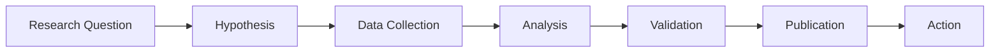

# Science Pod - Marine Research & Discovery

## Overview

The Science pod is IMAC's research engine, where rigorous scientific methods meet cutting-edge AI to unlock the mysteries of our oceans. We conduct hypothesis-driven research, analyze marine data, and generate insights that drive conservation action.

## Purpose & Mission

The Science pod:
- **Conducts** reproducible marine research using standardized methodologies
- **Analyzes** diverse datasets from eDNA to satellite imagery
- **Discovers** patterns and insights about ocean ecosystems
- **Validates** findings through peer review and cross-verification
- **Shares** knowledge openly for global impact

## Research Domains

### Marine Biology
Understanding life in our oceans through:
- **Biodiversity Assessment**: Species surveys and population dynamics
- **Ecosystem Analysis**: Food webs, habitat mapping, ecological interactions
- **Behavioral Studies**: Migration patterns, feeding behavior, reproduction cycles
- **Conservation Biology**: Endangered species monitoring, habitat restoration effectiveness

### Bioinformatics
Decoding the ocean's molecular signatures:
- **eDNA Analysis**: Species detection from water samples
- **Metagenomics**: Microbial community profiling
- **Metabolic Networks**: Understanding ecosystem functions
- **Phylogenetics**: Evolutionary relationships in marine life

### Oceanography
Studying the physical and chemical ocean:
- **Climate Impacts**: Temperature, acidification, sea level changes
- **Current Modeling**: Ocean circulation and connectivity
- **Biogeochemistry**: Nutrient cycles, carbon sequestration
- **Pollution Tracking**: Microplastics, chemical contaminants

## Our Approach

### Scientific Method in Action



### Key Principles

1. **Reproducibility First**
   - All analyses are scripted and version-controlled
   - Raw data → processed results pipeline is transparent
   - Methods are documented in detail

2. **Data Integrity**
   - Complete provenance tracking
   - Metadata standards compliance
   - Quality control at every step

3. **Open Science**
   - FAIR data principles
   - Public datasets when possible
   - Collaborative analysis

4. **Continuous Learning**
   - Iterative refinement of methods
   - Integration of new techniques
   - Feedback loops with other pods

## Directory Structure

```
science/
├── README.md (this file)
├── science_context.md           # Operational guidelines
├── marine-biology/
│   ├── README.md
│   ├── biodiversity_analysis/
│   ├── ecosystem_modeling/
│   └── species_tracking/
├── bioinformatics/
│   ├── README.md
│   ├── eDNA_pipelines/
│   ├── metagenomics/
│   └── MNA/                    # Metabolic Network Analysis
└── oceanography/
    ├── README.md
    ├── climate_analysis/
    └── pollution_monitoring/
```

## Getting Started

### For New Researchers

1. **Choose Your Domain**
   - Browse subdirectories to find your area of interest
   - Read domain-specific READMEs for context

2. **Understand the Standards**
   - Review `science_context.md` for operational guidelines
   - Check data format requirements
   - Learn about our reproducibility standards

3. **Start with Templates**
   - Use notebook templates as starting points
   - Follow the standard analysis structure
   - Include proper documentation

### Example Projects

#### Coral Reef Health Assessment
```python
# Example workflow:
1. Load underwater imagery dataset
2. Apply species detection models
3. Calculate biodiversity indices
4. Analyze temporal trends
5. Generate conservation recommendations
```

#### eDNA Species Detection
```python
# Example workflow:
1. Process raw sequencing data
2. Quality filter and trim sequences
3. Match against reference databases
4. Statistical validation
5. Generate species occurrence maps
```

#### Ocean Acidification Monitoring
```python
# Example workflow:
1. Integrate sensor and satellite data
2. Calculate pH trends
3. Correlate with species data
4. Model future scenarios
5. Identify vulnerable areas
```

## Data Standards

### Input Data Types
- **Biological**: Species counts, eDNA sequences, acoustic recordings
- **Physical**: Temperature, salinity, pH, current data
- **Chemical**: Nutrient concentrations, pollutant levels
- **Imagery**: Satellite, drone, underwater camera data

### Output Standards
- **Reports**: Markdown with embedded visualizations
- **Data**: CSV/NetCDF with complete metadata
- **Code**: Jupyter notebooks with clear documentation
- **Visualizations**: Publication-quality figures

## Collaboration

### Within Science Pod
- Regular journal clubs to discuss methods
- Peer review of analyses before publication
- Shared datasets and reference materials

### With Other Pods
- **Hardware**: Receive sensor data, request new deployments
- **Software**: Use AI models, request new tools
- **Education**: Provide content for teaching materials
- **Core**: Follow orchestrated workflows

## Impact Metrics

We measure our success through:
- **Publications**: Peer-reviewed papers and reports
- **Datasets**: Publicly available research data
- **Models**: Validated ecological and predictive models
- **Conservation**: Real-world application of findings

## Contributing

We welcome contributions from:
- **Domain Experts**: Marine biologists, oceanographers, ecologists
- **Data Scientists**: Analysis methods, visualization
- **Field Researchers**: Data collection, validation
- **Citizen Scientists**: Observations, data processing

### Contribution Process
1. Review existing work in your area
2. Propose new analysis or improvement
3. Follow reproducibility guidelines
4. Submit well-documented notebooks
5. Participate in peer review

## Resources

### Key References
- [FAIR Data Principles](https://www.go-fair.org/)
- [BeBOP Consortium Standards](https://www.bebop-obon.org/)
- [Ocean Best Practices](https://www.oceanbestpractices.org/)

### Tools & Libraries
- **Python**: NumPy, Pandas, SciPy, Matplotlib
- **R**: tidyverse, vegan, phyloseq
- **Bioinformatics**: QIIME2, mothur, BLAST
- **Geospatial**: xarray, cartopy, GDAL

## Contact

For Science pod matters:
- Open an issue with `science-pod` label
- Join Science pod meetings (schedule TBD)
- Contact domain leads (TBD)

---

*Advancing ocean science through open collaboration and rigorous research* 
