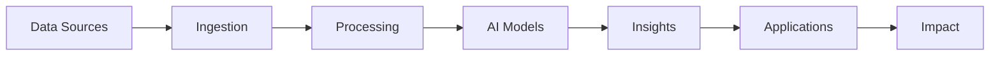

# Software Pod - AI Models & Computational Tools

## Overview

The Software pod is IMAC's computational powerhouse, where we develop cutting-edge AI models, data processing pipelines, and visualization tools that transform raw ocean data into actionable insights for conservation.

## Purpose & Mission

The Software pod:
- **Develops** state-of-the-art AI models for marine applications
- **Creates** efficient data processing pipelines
- **Builds** tools for analysis and visualization
- **Maintains** reusable software libraries
- **Enables** other pods with computational capabilities

## Technology Domains

### AI/ML Models
Advanced intelligence for ocean understanding:
- **Computer Vision**: Species identification, habitat mapping, behavior analysis
- **Time Series Analysis**: Environmental prediction, anomaly detection
- **Natural Language Processing**: Research paper analysis, report generation
- **Reinforcement Learning**: Autonomous vehicle navigation, sampling optimization

### Data Processing
Turning data into knowledge:
- **ETL Pipelines**: Extract, transform, load workflows
- **Real-time Processing**: Stream processing for sensor data
- **Batch Processing**: Large-scale historical analysis
- **Data Validation**: Quality assurance and cleaning

### Visualization
Making data beautiful and understandable:
- **Interactive Dashboards**: Real-time monitoring displays
- **Scientific Plots**: Publication-ready figures
- **3D Visualizations**: Ocean current modeling, habitat reconstruction
- **Web Applications**: Public-facing data portals

### Tools & Libraries
Building blocks for marine AI:
- **MarineAI Toolkit**: Core library for common operations
- **Data Connectors**: APIs for various data sources
- **Model Zoo**: Pre-trained models for marine applications
- **Utility Scripts**: Helper functions and workflows

## Development Philosophy

### Architecture Principles



### Key Principles

1. **Modularity**
   - Microservices architecture
   - Reusable components
   - Clear interfaces

2. **Scalability**
   - Cloud-native design
   - Distributed processing
   - Efficient algorithms

3. **Reproducibility**
   - Version control everything
   - Containerized environments
   - Documented dependencies

4. **Performance**
   - Optimized algorithms
   - GPU acceleration
   - Efficient data structures

## Directory Structure

```
software/
├── README.md (this file)
├── software_context.md          # Operational guidelines
├── models/
│   ├── README.md
│   ├── vision/                  # Computer vision models
│   ├── timeseries/             # Temporal analysis
│   ├── nlp/                    # Text processing
│   └── rl/                     # Reinforcement learning
├── pipelines/
│   ├── README.md
│   ├── etl/                    # Data pipelines
│   ├── streaming/              # Real-time processing
│   └── batch/                  # Large-scale analysis
├── visualization/
│   ├── README.md
│   ├── dashboards/             # Interactive displays
│   ├── plots/                  # Static visualizations
│   └── web/                    # Web applications
├── tools/
│   ├── README.md
│   ├── marineai/               # Core library
│   ├── connectors/             # Data source APIs
│   └── utils/                  # Helper functions
└── tests/
    ├── unit/                   # Unit tests
    ├── integration/            # Integration tests
    └── benchmarks/             # Performance tests
```

## Getting Started

### For Developers

1. **Set Up Environment**
   ```bash
   # Clone the repository
   git clone https://github.com/IMAC/software-pod
   
   # Install dependencies
   pip install -r requirements.txt
   
   # Run tests
   pytest tests/
   ```

2. **Choose Your Focus**
   - Browse existing projects in subdirectories
   - Check open issues for needed features
   - Review the roadmap for upcoming work

3. **Follow Best Practices**
   - Write clean, documented code
   - Include comprehensive tests
   - Create clear examples

### Example Projects

#### Fish Species Classifier
```python
# Computer vision model for species identification
from marineai.vision import SpeciesClassifier

model = SpeciesClassifier(pretrained=True)
species, confidence = model.predict(image)

# Features:
# - 500+ marine species
# - 95% accuracy
# - Real-time inference
# - Uncertainty quantification
```

#### Ocean Temperature Predictor
```python
# Time series model for temperature forecasting
from marineai.timeseries import TemperaturePredictor

predictor = TemperaturePredictor()
predictor.fit(historical_data)
forecast = predictor.predict(horizon=30)  # 30-day forecast

# Features:
# - Multi-location support
# - Confidence intervals
# - Climate model integration
# - Anomaly detection
```

#### Habitat Mapping Pipeline
```python
# End-to-end pipeline for habitat analysis
from marineai.pipelines import HabitatMapper

pipeline = HabitatMapper()
pipeline.add_data_source('satellite', satellite_api)
pipeline.add_data_source('in_situ', sensor_network)
habitat_map = pipeline.run()

# Features:
# - Multi-source fusion
# - Automated QA/QC
# - Change detection
# - Report generation
```

## Integration Guide

### API Standards
```python
# All models follow consistent interface
class MarineAIModel:
    def __init__(self, config):
        """Initialize with configuration"""
        
    def predict(self, input_data):
        """Make predictions"""
        
    def evaluate(self, test_data):
        """Evaluate performance"""
        
    def save(self, path):
        """Save model state"""
        
    def load(self, path):
        """Load model state"""
```

### Data Formats
- **Images**: JPEG/PNG with metadata
- **Time Series**: Pandas DataFrame with datetime index
- **Geospatial**: GeoJSON, NetCDF
- **Models**: ONNX for interoperability

### Deployment Options
- **Cloud**: Docker containers on Kubernetes
- **Edge**: Optimized models for embedded devices
- **Hybrid**: Cloud training, edge inference

## Collaboration

### Within Software Pod
- Code reviews on all PRs
- Weekly architecture discussions
- Shared model repository
- Performance benchmarking

### With Other Pods
- **Science**: Model requirements, validation
- **Hardware**: Edge deployment, optimization
- **Education**: Tutorial creation, examples
- **Core**: Integration in workflows

## Performance Metrics

We track:
- **Model Accuracy**: Validation metrics
- **Processing Speed**: Throughput benchmarks
- **Resource Usage**: Memory and compute efficiency
- **Code Quality**: Test coverage, documentation

## Contributing

We welcome contributions from:
- **ML Engineers**: Model development and optimization
- **Data Engineers**: Pipeline and infrastructure
- **Software Developers**: Tools and applications
- **Domain Experts**: Requirements and validation

### Contribution Guidelines
1. Fork the repository
2. Create a feature branch
3. Write tests for new code
4. Document your changes
5. Submit a pull request

### Code Standards
- Python: PEP 8 style guide
- Type hints for all functions
- Docstrings in NumPy format
- 90%+ test coverage

## Resources

### Development Tools
- **Languages**: Python, R, Julia
- **ML Frameworks**: PyTorch, TensorFlow, scikit-learn
- **Data Tools**: Pandas, Xarray, Dask
- **Visualization**: Matplotlib, Plotly, Bokeh

### Learning Materials
- [MarineAI Documentation](https://docs.marineai.org)
- [Tutorial Notebooks](./tutorials/)
- [API Reference](./docs/api/)
- [Best Practices Guide](./docs/best-practices.md)

### Model Zoo
Pre-trained models available:
- Species classifiers (fish, coral, plankton)
- Habitat segmentation models
- Time series predictors
- Anomaly detectors

## Contact

For Software pod matters:
- Open an issue with `software-pod` label
- Join Software pod meetings (schedule TBD)
- Slack channel: #software-pod

---

*Empowering ocean conservation through intelligent software* 
